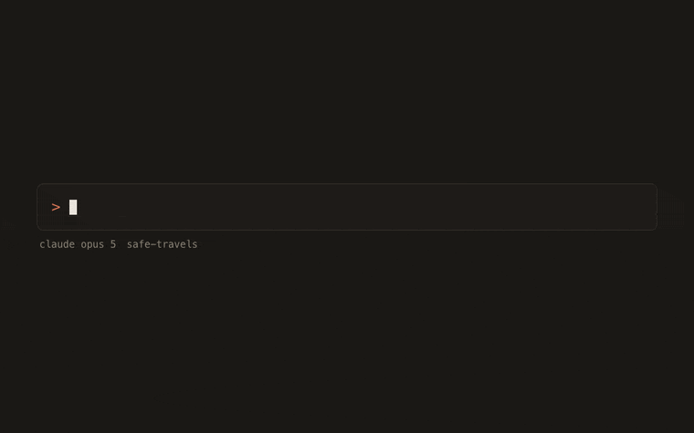
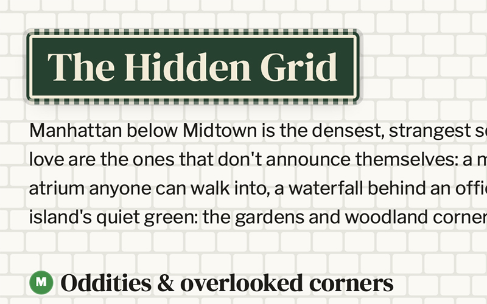
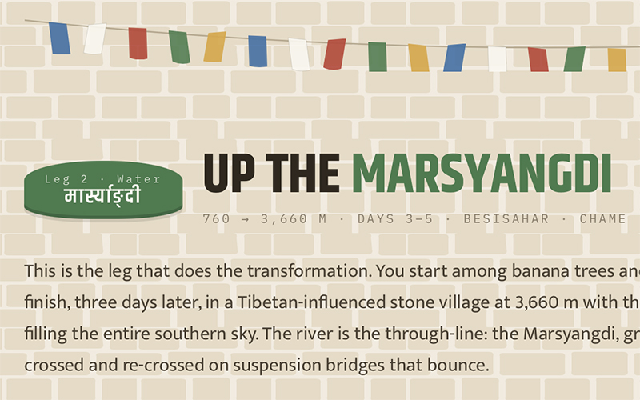
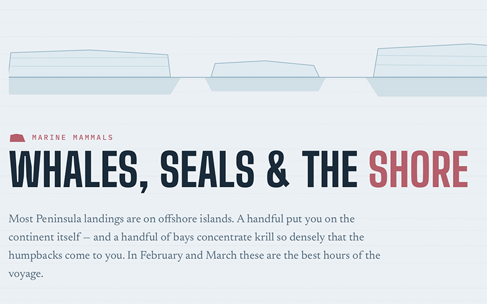
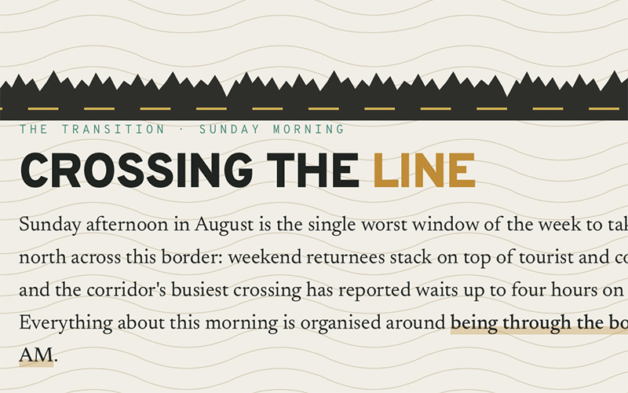
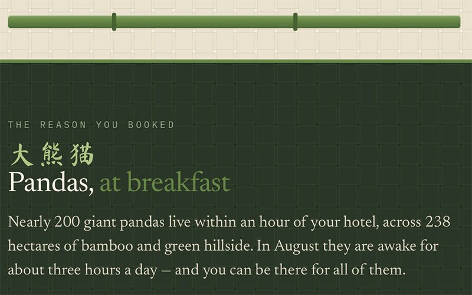
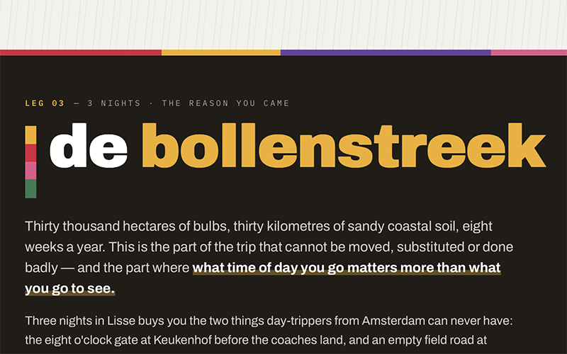
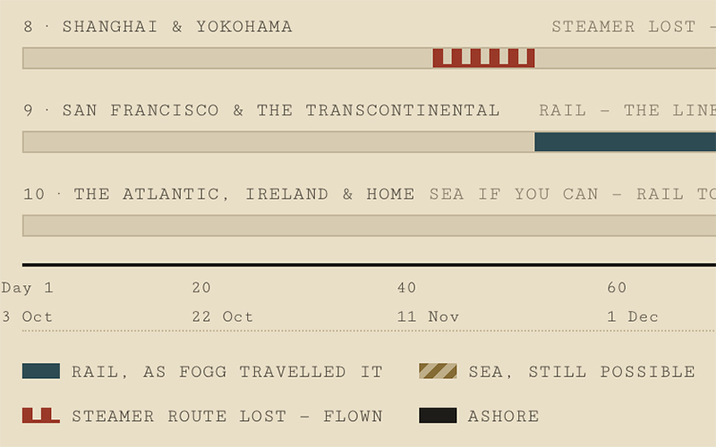

# Safe Travels

The only travel guide made just for you!



Safe Travels is a Claude Code plugin that conjures up one-of-a-kind travel guides
upon request. Whether you're traveling with kids, hiking across Europe, or just
wondering how you even get to Antarctica — it integrates every aspect of your
travel needs and interests and puts it all together in a fun guide for you to
explore and share.

## How to create your own guide

1. Run the plugin `/safe-travels:create-guide` and describe the trip the way you'd tell a friend — a city, a region,
   a route, or just a question. Season, travelers, trip length, interests: share what you have.
2. It plays the plan back and asks for any missing info. Add as much or as little as you like.
3. Your research team fans out, and the guide is written, designed, and saved as `guide.html`.
4. Open it in your browser. Want changes — more food, a different pace, another town? Just ask.

## Sample guides

Real asks, and the guides that came back:

| The ask | The guide |
|---|---|
| _"New York City in October, I've been 100 times, show me the side the locals love"_ | [](https://nickeng.github.io/safe-travels/samples/new-york-city.html) |
| _"Annapurna circuit, it's my first major trek"_ | [](https://nickeng.github.io/safe-travels/samples/annapurna.html) |
| _"I want to see Antarctica. When is the best time to go? How do I even get there?"_ | [](https://nickeng.github.io/safe-travels/samples/antarctica.html) |
| _"I want to see a puffin"_ | [](https://nickeng.github.io/safe-travels/samples/puffin.html) |
| _"RV family road trip, plan a drive from Sea-Tac to Whistlers Campground. I have 2 daughters in high school who won't take a hike more than 30 min without complaining to high hell."_ | [](https://nickeng.github.io/safe-travels/samples/seattle-jasper.html) |
| _"Visiting Chengdu in August with our 1 year old"_ | [](https://nickeng.github.io/safe-travels/samples/chengdu.html) |
| _"I want to do a garden tour in the Netherlands, April or May"_ | [](https://nickeng.github.io/safe-travels/samples/netherlands.html) |
| _"I want to walk the Camino de Santiago, the last 100km"_ | [](https://nickeng.github.io/safe-travels/samples/camino.html) |
| _"Around the world in 80 days, just like Phileas Fogg"_ | [](https://nickeng.github.io/safe-travels/samples/80-days.html) |


## Install

Temporary instructions before the inevitable agent store.

1. Set `CLAUDE_CODE_MAX_SUBAGENT_SPAWN_DEPTH` to 2 in the env in `~/.claude/settings.json`. This is required for the research team to fan out.
2. Install the plugin:
```
/plugin marketplace add nickeng/safe-travels
/plugin install safe-travels@safe-travels
```

## A note on accuracy

These guides are researched and assembled by AI, and details drift — opening hours, prices, dates,
and transit change, and mistakes are possible. Every guide links its sources, so double-check
anything your plans depend on.

## License

This work is licensed under a
[Creative Commons Attribution-NonCommercial-ShareAlike 4.0 International License][cc-by-nc-sa].

[cc-by-nc-sa]: https://creativecommons.org/licenses/by-nc-sa/4.0/
