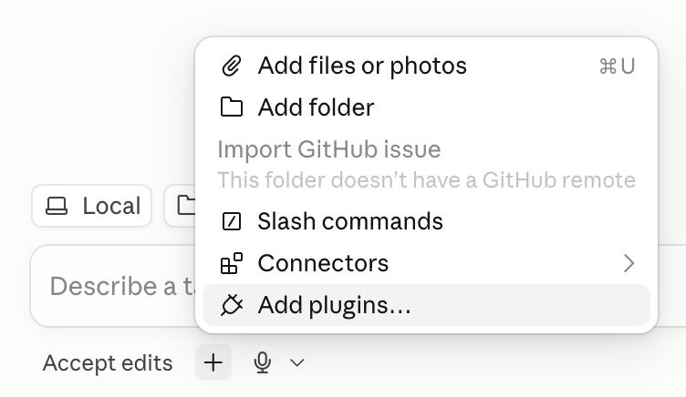
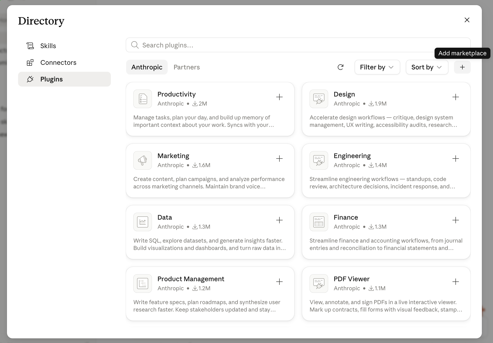
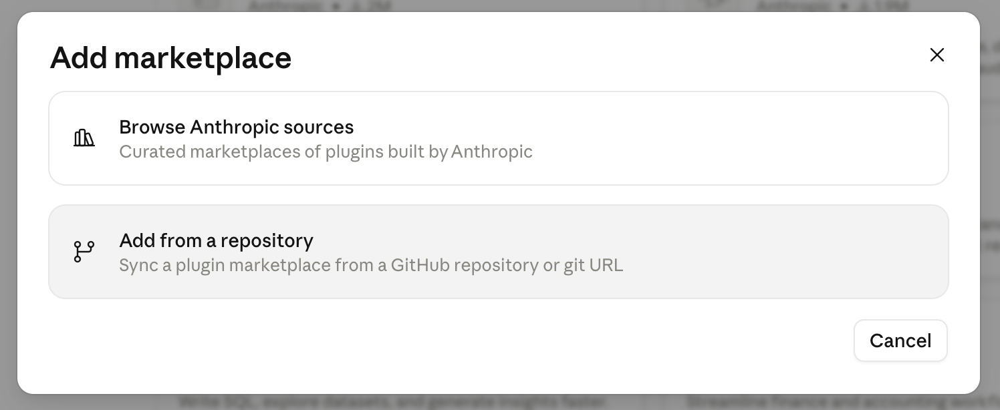
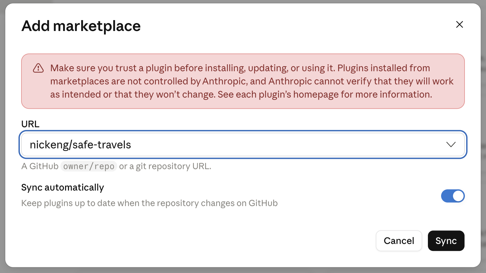
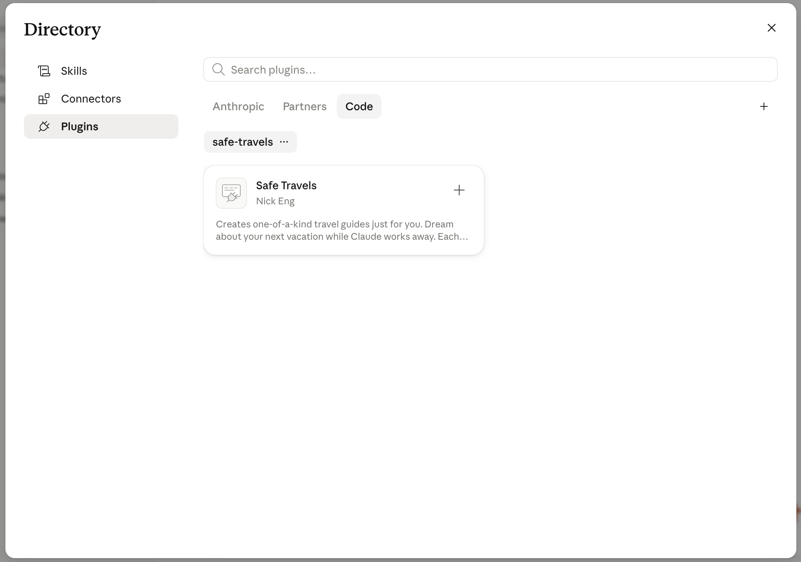
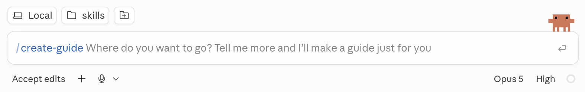
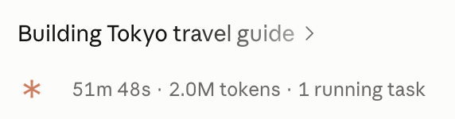
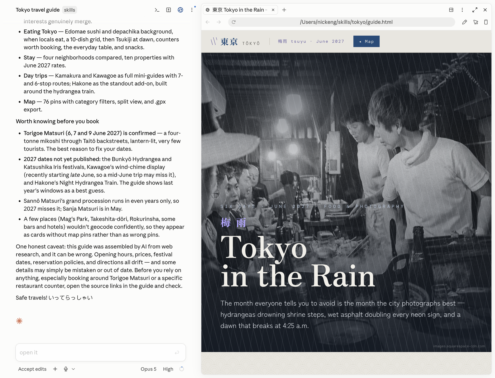

# Install Guide

## Requirements

* Install [node](https://nodejs.org/en/download) to run the required scripts
* Ask Claude to set `CLAUDE_CODE_MAX_SUBAGENT_SPAWN_DEPTH` to 2 in the env in `~/.claude/settings.json`

## Installation

To install within the Claude desktop app, press the **＋** button near the chat box and select **Add Plugins**:

In the popup press the **＋** button again to add a marketplace:

Select **Add from a repository**:

Then enter `nickeng/safe-travels` and press **Sync**:

Back in the plugins popup select the **Code** tab and you should see the Safe Travels plugin. Press the **＋** on Safe Travels card to install:

## Usage

After install you can now create guides by typing `/safe-travels:create-guide` then entering your trip information:

This will start the creation of your guide, note it takes 30-60mins to create a guide:

When Claude is done your guide will open in the app:

Open the guide in your browser for a fullscreen view.
